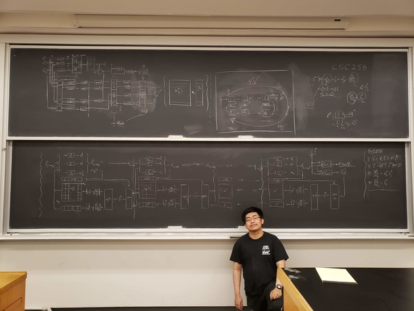
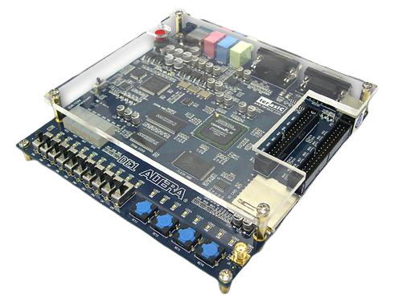

# FPGA_NN

## FPGA Neural Network

So you want to build a hardware neural network.

### Background

This project was inspired by UofT's CSC258 Computer Organization course.
I'm by no means an expert on the topic, and would highly recommend
[this book](http://neuralnetworksanddeeplearning.com/chap1.html)
to anyone looking to learn the basics of machine learning. Without going into
the details, the plan seemed fairly simple from the start; each component and
level of the network, be it a neuron or layer, as well as any mathematical
operations not built into Verilog, would have a corresponding module written.
The network's setup would be determined by a Python script and training would
be done by loading the MNIST dataset. Having a sufficient understanding of the
topic already, our first schematics were drawn up fairly quickly.

Of course, things didn't go as smoothly as expected. I should start off by
saying the problems we ran into were rarely machine learning related; a simple
neural network can reach 95% accuracy on the MNIST dataset with a bit over 100
lines of code in a high level language, and is relatively rudimentary. Rather,
the majority of our problems arose from Verilog's limitations (especially when
compared to its modern counterpart SystemVerilog), and the 5CSEMA5F31C6 chip we
had available to us.

### Network Challenges

Lets start off with the obvious - the board. While the DE1-SoC
is a great board for teaching the basics of computer organization and FPGA development,
it proved quite lacking for a project of this scale. The first problem we encountered
was that the size of the chip did not allow for a network with back-propagation,
much to our disappointment. We were forced to instead load weights and biases
from the aforementioned Python script and implement only the feed-forward portion
of the network on the actual FPGA.

To make matters worse, the board was also quite lacking in memory; as the number
of weights and biases grows exponentially with layers, these values had to be loaded
onto the board's RAM instead of registers directly on the chip. While this
isn't a major issue in terms of difficulty, it did complicate the design
and timing of the network considerably, which cost a lot of development time.
Board limitations were brought up as a possibility beforehand. Unfortunately,
we were completely unprepared for the restrictions Verilog '05 would lay down.
There were several small things here and there, my personal favorite being
the lack of support for two-dimensional arrays. It wasn't uncommon to write
Python scripts to write repetitive Verilog code, which is as horrifying
as it sounds.

But the biggest issue was the lack of floats. In short, Verilog 2005's built-in real
data type is completely unusable for this project, as they do not support the
mathematical operations required. Integers were workable, asides from the fact that
rounding that much would make the neural network beyond worthless (thanks to
our use of the Sigmoid function). This meant that we were forced to create
a new number representation in Verilog, as well as all of its corresponding
operations; everything from hadamard products to basic addition. Our final
solution was to represent floats with 32-digit integers as "binary" instead,
and write all the necessary operations from there. This was a very crude
way to represent doubles in the language, but was the only solution that
we were able to implement given our deadlines. While it works, its not
very memory efficient and definitely a pain for humans to read.

### UI Challenges

The UI of the project also presented a few minor problems, mostly
resulting from the same language restrictions encountered in the other
parts of the project, as well as some new ones (such as converting png
to mif). The best example of "Verilog should support this but doesn't"
was the lack of a modulo function, which made converting cursor position
to a square on the 14x14 grid (on which users "wrote" their number) much
more difficult than it should've been. I've been pretty hard on Verilog 2005,
but in all fairness many of these so called restrictions make much more
sense once placed in the context of a hardware description language, as
opposed to a high level language like C or Python. While SystemVerilog
would've made this project much simpler, at the end of the day many of
these issues are just direct results of working with hardware.

### Conclusions

With everything said, we were ultimately able to get the neural network up
and running, albeit with a few compromises. I'd like to thank my partner,
Wentao, for powering through countless all-nighters and teaching me the basics
of machine learning. I'd also like to thank our professor, Rabia Bakhteri,
for her guidance and support throughout the development period.
The source code for the project can be found
[on my GitHub here](https://github.com/FSq-Poplar/FPGA_NN)
. Note some
modules, such as the top level network module and conversion from MNIST to
our 14x14 grid, have been omitted to prevent direct resubmission by future
CSC258 students.
