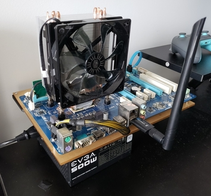
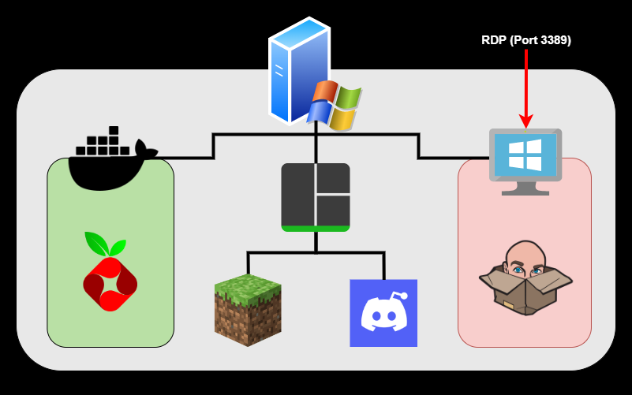

# Frankenstein

## The Build

"That's not a scrapyard PC that's a f*cking frankenstein
build"

\- I forgot who said this

(Approximate
[PCPartPicker](https://ca.pcpartpicker.com/list/FffDPn)
for the brave)

I wanted a proper home server, but had a budget of
literally 100 dollars (plus whatever parts I already
had lying around). Ideally the solution would've been
an old X99 Xeon combo running different VMs for the
things I needed deployed using Unraid, but this was
obviously well beyond the very modest budget.
Regardless, this early 2010 hardware was able to run
a lot more than I expected.

## Setup

I'm bad at making diagrams.

### Top level - Windows

Linux would have been a better choice performance
wise, on top of just generally being a superior
choice for any home server setup. Unfortunately, the
USB wifi adapter I had did not have drivers on Linux,
and there was no good way to hook up ethernet.

Thankfully this didn't cause any major issues. I had
a Minecraft server and a Discord music bot hosted
on the top level OS (Minecraft servers are usually
safe enough to expose directly to the internet),
and had TMux running on WSL to make management a bit
easier. Running Windows also had the added benefit
of enabling RDP (without port forwarding of course)
for debugging purposes, although this wasn't used
that often as SSH is almost always sufficient.

### Docker - PiHole

The one thing that couldn't run natively on Windows
is PiHole, and several forums warn running it using
WSL is a bad experience; thankfully, Docker images
are shockingly lightweight and thus could be run
on this machine with minimal compute cost.

### Windows VM - Jackbox

Someone once asked to borrow my server so they
could run additional Jackbox sessions for some
introduction event for school (or something along
those lines). The temporary solution on that day
was to port forward RDP and give them the credentials,
but this is a very bad thing to do for obvious
reasons and was disabled immediately after the event.

Having a Jackbox machine that anyone with the
credentials could use on request sounded appealing,
and the long term solution was to just run it in a
VM. This negates a lot of security concerns if
properly isolated, and has the added benefit of
not nuking other things (ie PiHole which was my DHCP
server) whenever people instinctively hit "shut down".
