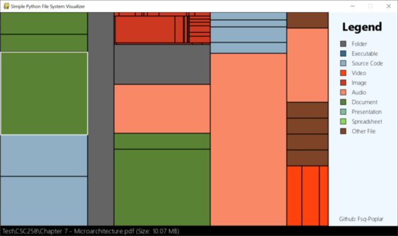

# Visualizer

A throwback to my freshman year - this was actually made
from a school assignment in which we made a storage visualizer
to practice working with trees. I needed to find ogg music files
in a game folder, and ended up adding the file type colorization
to the original assignment to find the them; later I rebuilt it
from scratch and this tool took shape.

It creates a custom tree implementation containing all the relevant
information to render, such as color, location, size etc - the
"FileSystemTree" class. While definitely not the most efficient
way to do it (as such data structures already exist as the actual file
system), as previously mentioned a large part of this assignment
was to practice working with the data structure. To that end, I kept
that design choice from the original assignment.

You can find the repository
[here](https://github.com/FSq-Poplar/storage_visualizer).
