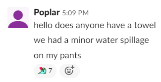

# Hackathons

After having participated in several, I'm not sure how I feel about
hackathons.

On one hand, they're a great place to set aside a good chunk of time
(48~72 hours) and actually work on something, instead of getting
distracted by Reddit, Valorant or whatever. This results in a
surprising amount of learning, since we students are usually swamped
by school assignments which are almost always focused on theoretical
computer science instead of actual software development. Of course,
they're also fun environments in general; I definitely have a lot
of good memories from participating in them.

Well, mostly fun.

On the other hand, this very time restriction results in a lot of
optimizations being made which are honestly pretty bad; it's no
coincidence that tons of projects at these events are put together in
Python, which is fast to prototype with due to its simplicity and
rich ecosystem but has awful performance as an interpreted language.
This is without even mentioning the [poor quality of code](
    https://64.media.tumblr.com/381bad04cbec692ebd3ca694d5ad8f17/tumblr_nbjtmz6YbJ1tjza4wo4_1280.png
) that comes
out of working with such tight time restrictions.

The issue that ultimately resulted in FSq ceasing to participate
in them was the heavy favoritism towards projects that focus on
"direct social good". While these are obviously important issues
to divert efforts on, it ends up feeling very illegitimate at
hackathons, instead feeling like sucking up to the judging criteria.
It's no secret that a majority of submissions are clones of previous
Devpost winners.

With this in mind, I guess the not-so-short tldr is as follows:
hackathons are a great place to force yourself to set some time
aside, and learn something new. This could be a new technology,
development practice, or in the case of younger students even
basic things such as "what is an HTTP request and how do I work
with them?"

But if that's your end goal, anyone with the discipline is better
off gathering a couple friends and just working on a project
on the side. There's no unreasonable time restrictions, nor a
need to suck up towards judging criteria; the team can build
whatever they want to build instead.

That being said, they're pretty damn fun. So if you just want
to get some fun recreational programming done with some friends,
or even just some free company swag, then I'd highly recommend
them - caffeine fueled all-nighters are pretty funny.
