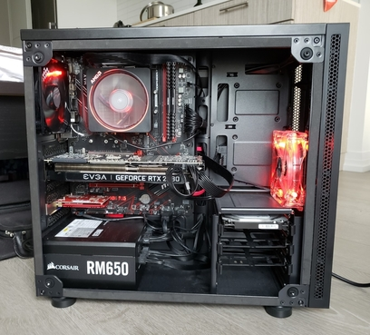

# Nocturnal

## The Build

Jokingly named Nocturnal, as building this PC made my sleep schedule so.

You can see the PCPartPicker [here](https://ca.pcpartpicker.com/list/fLmXTC).

## Part Selection

### CPU

The CPU of choice was the Ryzen 7 3700x.

AMD over Intel was a fairly obvious choice, given their current
advantage over Intel in both price to performance and multi-threaded
applications. I chose a Ryzen 7 over a Ryzen 5 as I find myself
running multi-threaded workloads often enough to justify the upgrade,
but not often enough to pay the extra for something like the Ryzen 9 3900x
(which offers
[no benefit in single threaded applications](https://tinyurl.com/53phj8b2)).
As for the 3800xt, the performance gains are marginal, especially when
factoring in the roughly 25% increase in price.

### GPU

I built this PC for both gaming and machine learning, so my GPU choice was
whatever was best within my budget - this ended up being the Nvidia 2080 SUPER.
In essence, the only decision made here was how much I was able to spend.
While I wanted a Gigabyte Windforce for the quieter three fan heatsink, it wasn't
in stock at the time and the EVGA Black was the next cheapest option with favorable
reviews.

### Motherboard

For the motherboard, I went with a MSI B450 Gaming Plus MAX.

While B550 was available when I built this PC, I didn't see myself needing
PCI Express Gen 4 for any practical reason anytime soon (little did I know
the upcoming RTX 3000 video cards would make use of it). Additionally, with
AMD's announcement that B450 boards would support 4th gen Ryzen, the newer
chipset just seemed like a waste of money given the higher prices. I avoided
X570 for a similar reason. As for why this specific MSI board, they're well
respected in the price point (Gaming Plus Max and A-Pro Max), but I hated
the color of the A-Pro. A Tomahawk would've been nice, but at the time was
as expensive as an X570 board.

### RAM

The actual model was a kit of Corsair Vengeance LPX (2X8)GB DDR4-3200 CL16,
but the only relevant choice made here was speed and QVL compatibility.

I actually originally wanted to go for a kit of G.SKILL Ripjaws V, as the
color scheme better fit my build. The kit I wanted ended up not being on my
motherboard's QVL, and despite Ryzen's general compatibility with high
frequency RAM, I didn't want to take the risk. Corsair's kits ended up being
the best value available at the time. As for the clock speeds, 3200CL16 and
3600CL18 have
[practically identical latencies](
    <https://forums.tomshardware.com/threads/3200-cl16-vs-3600-cl18-%E2%80%94-the-better-choice.3535789/>
),
so the much cheaper 3200Mhz kit was far more appealing than a higher
frequency kit which would offer maybe 1% actual performance gains on a good day.

### Misc

Everything else is fairly standard, asides from the Asus PCE-AC56 wireless
card which I added due to lack of CAT6 wiring in my apartment.

Corsair's RMx series are well respected PSUs (A-tier on the cultist list!)
and is fully modular, although I never ended up taking advantage of that.

As for storage, Seagate's Barracudas are very common choices with good reason.
For the OS drive/M.2 SSD, I again went with Seagate despite it not being
the most performant option, just to keep warranties in one place.
