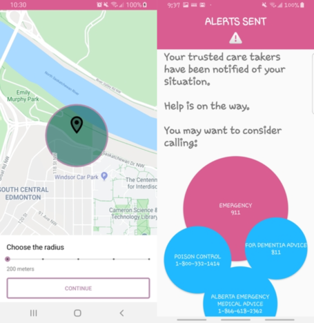

# PpoBO

This is a very condensed summary - for more details, please
visit the Devpost post [here](https://devpost.com/software/ppobo-skuhd0).

PpoBO is a health and safety app for caretakers to help those
who suffer from dementia and alzheimer's. It was made using
native android, with geofencing being taken care of by Google
Maps API.

PpoBO won first place overall at HackED 2020, and was later
presented at Startup Edmonton. You can find the repo
[here](https://github.com/FSqDev/PpoBO).
