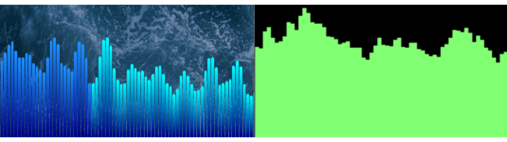

# WaveFormJS

WaveForm.JS is an audio visualization library which uses CSS
for styling, rather than the traditional method of using HTML's
Canvas API. You can find documentation and examples with code
[here](https://fsq-poplar.com/WaveFormJS/).

The idea behind using Divs (and by extension CSS) rather than
a Canvas element is that the user has complete control of styling.
Due to the difficulty and boilerplate associated with the Canvas
API, visualization libraries which use Canvas are relatively locked
down in terms of appearance, with users being forced to pick presets.

Said limitations can be seen more clearly by comparing the single
bar visualizer between WaveForm.js on the left and
[Wave.js](https://foobar404.dev/Wave.js/) on the right:

This is by no means an attempt to state that this approach is
objectively better, or that existing audio visualization libraries
insufficient. There are use cases for both - my approach creates
inherent limitations on the number of points in the visualizer,
and also requires considerably more compute overhead due to the
DOM manipulation. That being said, I do believe that granting
this level of control to end users will ultimately result in
better looking visualizers overall, while also removing the
difficult parts of coding them.
